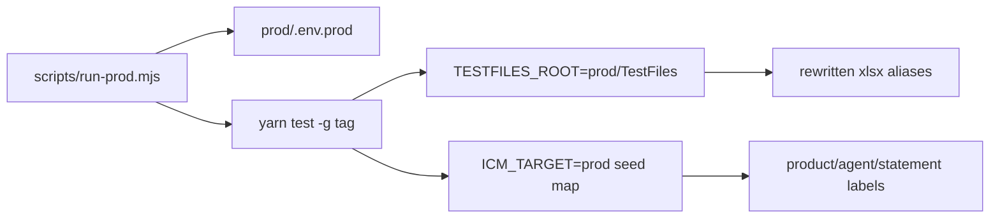

# Prod run folder for @sanity and @smoke

## Approach (locked)

Keep one Playwright project. Add a **`prod/`** folder that holds only prod-specific assets (env template, seed map, Excel root). Activate via env (`ICM_TARGET=prod` + `TESTFILES_ROOT`) through a thin runner. No second package, no feature fork, no new `package.json` scripts (invoke `node scripts/run-prod.mjs` directly per [package-scripts](.cursor/rules/package-scripts.mdc)).



## Folder layout

```
projects/icm/prod/
  README.md                 # how to fill creds + run tags
  .env.prod.example         # BASE_URL, emails, TESTFILES_ROOT, ICM_TARGET
  .env.prod                 # gitignored — real password
  seed-map.json             # preprod → prod label remaps
  TestFiles/                # content from current TestFiles-prod-sanity (re-run prep)
```

- Move/repurpose existing [TestFiles-prod-sanity/](TestFiles-prod-sanity/) into `prod/TestFiles/` (update [scripts/prep-prod-sanity-testfiles.mjs](scripts/prep-prod-sanity-testfiles.mjs) `destRoot`).
- Keep [projects/icm/.env](projects/icm/.env) preprod-primary; runner sets process env **before** spawn so [utils/loadEnv.ts](utils/loadEnv.ts) does not overwrite (`if process.env[key] === undefined`).

### `prod/.env.prod.example` keys

- `BASE_URL=https://icm.pieq.ai/`
- `E2E_EMAIL` / `E2E_EMAIL_ADVANCE` / `E2E_EMAIL_AGENCY3` / `E2E_EMAIL_OWNER` / `E2E_EMAIL_AGENT` → ops login used for seeding (`saadiyamalan.a@pieq.ai`)
- `E2E_PASSWORD=` (user fills locally)
- `ICM_TARGET=prod`
- `TESTFILES_ROOT=prod/TestFiles` (resolved from project root)
- `REPORT_ENV=prod` / `REPORT_TAG=icm prod` (Slack/report clarity)

### `prod/seed-map.json` (from seeded data)

| Kind | Preprod | Prod |
|---|---|---|
| Advance alias | `aetna-aca-test-advance-month-july-21` | `test-aetna-aca-test-advance-month-july-21` |
| Chargeback alias | `aetna-test-product-001` | `test-aetna-test-product-001` |
| Transfer product | `Aetna-Test-Product` | `test-Aetna-Test-Product` |
| Transfer alias | `2025-jan-1-aetna-test-001` | `test-2025-jan-1-aetna-test-001` |
| Transfer agent display | `Test Transfer Agent` | `test-Agent Test Transfer` |
| Writing agent display | `DevaTest Agent` | `test-DevaTest Agent` |
| Statement types | `Aetna ACA`, `MLB` | `Aetna ACA` (trial) |

NPNs stay unchanged (`120876543`, `0987654321`, `600011`, …).

## Code wiring (minimal)

1. **`utils/testFilesRoot.ts`** — `testFilesRoot()` returns `path.resolve(TESTFILES_ROOT)` or default `TestFiles/`.
2. **`utils/prodSeedMap.ts`** — load `prod/seed-map.json` when `ICM_TARGET=prod`; export `mapSeedLabel(s)`, `mapStatementType(s)`.
3. **All `test-data/**` modules** that hardcode `path.join(projectRoot, 'TestFiles', …)` (~16 files, e.g. [validateAdvanceOnly.ts](test-data/advance-only/validateAdvanceOnly.ts), [transferSheet.ts](test-data/transfer-agent/transferSheet.ts)) → use `testFilesRoot()` for `templateDir` / `generatedDir` / inbox paths.
4. **Prod label getters** in transfer/mmp configs (and any hardcoded product/agent strings used by POMs): when `ICM_TARGET=prod`, return mapped names from seed map instead of preprod literals (`productName`, `transferAgent.fullName`, `productGridName`, [TransferSheetPage](pages/settings/TransferSheetPage.ts) fallback list entry).
5. **Statement type** — apply `mapStatementType` at select sites (POM `selectStatementType` or shared helper used by upload steps) so Gherkin `"Aetna ACA"` / config `MLB` become **Aetna ACA** on prod without editing `.feature` files.
6. **Gherkin-passed names** — transfer-sheet / e2e-transfer steps that take agent/product `{string}` run arguments through `mapSeedLabel` so `"Test Transfer Agent"` / `"Aetna-Test-Product"` hit prod UI names.
7. **`scripts/run-prod.mjs`** — read `prod/.env.prod`, set env, require password + `ICM_TARGET=prod`, then `spawn('yarn', ['test', ...process.argv.slice(2)], { stdio: 'inherit', env })`.
8. **`prod/README.md`** — fill `.env.prod`, regenerate Excel (`node scripts/prep-prod-sanity-testfiles.mjs`), run commands below; checklist for commission/levels already seeded.
9. **`.gitignore`** — add `prod/.env.prod` (and keep `prod/TestFiles/**/.generated` if needed).

## How to run (documented in README)

```powershell
# once: copy example → fill password; regenerate Excel
copy prod\.env.prod.example prod\.env.prod
node scripts/prep-prod-sanity-testfiles.mjs

# smoke (ops modules — works with Ops Manager account)
node scripts/run-prod.mjs -g "@smoke-modules" --retries=0 --reporter=line

# sanity (seeded modules)
node scripts/run-prod.mjs -g "@sanity" --retries=0 --reporter=line
```

## Scope / known exclusions for first prod pass

- **In scope:** modules that use seeded Aetna/`test-` products + agents (advance family, chargeback, transfer, mmp, payment, statement-upload, happy-flow, policy-cancellation*, agent-master create).
- **Expect fail / exclude until backend statement setups exist:** anything that cannot select **Aetna ACA** as stand-in; escalate per prior decision.
- **Not seeded on prod:** Oscar / `ValidateCommissionSplit` / `@oscar-u65-cs` / commission-report truth sheets — run with `-g "@sanity"` then narrow, or exclude those tags on first pass (`-g "@sanity" --grep-invert "@oscar-u65-cs|@validate-commission-report"` if needed).
- **Smoke roles:** `@smoke-role` / `@owner` / `@agent` need real Agent and Agency Owner accounts. With all emails = Ops Manager, only **`@smoke-modules`** (ops) is reliable; document that in README rather than inventing role users.

## Validation

1. Re-run prep; confirm `prod/TestFiles/` has rewritten xlsx (cells match `_rewrite-report` style).
2. `node scripts/run-prod.mjs -g "@TEST-001-smoke" --retries=0 --reporter=line` — login hits `icm.pieq.ai`.
3. One sanity probe: `-g "@TEST-001-Advance-Only-ARF"` or transfer upload tag — Excel alias resolves under `prod/TestFiles`, statement type maps to Aetna ACA.
4. If statement select fails → stop; human backend statement setup (do not invent).

## Out of scope

- Editing committed `.env` / preprod `TestFiles/`
- Duplicating features under `features-prod/`
- Adding `yarn test:prod` / `test:sanity:prod` scripts to `package.json`
- Activating Onboarding agents via email (human/ops) — runner assumes levels + advance toggle already done as you completed manually
