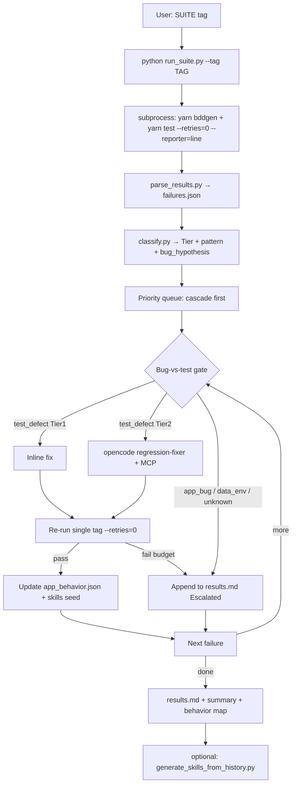

# Test Runner Agent — v2 (Python subprocess + triage + behavior map)

**Agent name:** Test Runner  
**OpenCode slug:** `test-runner`  
**Skill name:** `test-runner`  
**Runner:** `scripts/test_runner/*.py` (agent-window friendly; no new yarn scripts)

## Why upgrade

v1 plan assumed agent shells `yarn test` directly and classifies in-prompt. That burns tokens on parse noise, loses structured history, and never closes the loop from past OpenCode fix campaigns into reusable skills / app-behavior facts.

**v2 goals (this upgrade):**

1. **Run suite inside agent window** via **Python subprocess** (`yarn bddgen` + `yarn test -g … --retries=0 --reporter=line`) so orchestration is deterministic and log-captured.
2. **Collect results** into machine-readable JSON + human markdown.
3. **Categorize errors** (Tier 1/2/3 + pattern letter A–T).
4. **Verify real bug vs test bug** (MCP / evidence gate) before editing.
5. **Fix** Tier 1/2 when proven; **escalate** everything else — **all escalations written into one results markdown** (never silent drop).
6. **Generate / refresh skills** from OpenCode regression fix history (`REGRESSION_FIX_PLAN.md`, `regression-fixer.md`, `fix-harvested-e2e-tests`).
7. **Structured app-behavior map** (`app_behavior.json`) so next runs reuse proven product facts instead of re-discovering (e.g. “cannot deselect all carriers → default state”).

**Reality check:** v1 todos were marked completed but artifacts (`.opencode/agents/test-runner.md`, skills) are **missing**. Treat v1 as design only; v2 implements from scratch.

---

## Architecture



**Agent split:**

| Role | Component | Responsibility |
|------|-----------|----------------|
| Orchestrator | OpenCode/Cursor **test-runner** + Python scripts | Run, parse, classify, queue, report, escalate markdown |
| Fixer | existing `regression-fixer` | MCP investigate + minimal patch (one tag) |
| Patterns | `fix-harvested-e2e-tests` + generated taxonomy | A–T hypotheses |
| Behavior memory | `.generated/test-runner/app_behavior.json` | Proven product facts |
| Skill miner | `generate_skills_from_history.py` | Refresh skills from fix history |

**Cursor vs OpenCode:**

- **OpenCode:** may call Playwright MCP for bug-vs-test gate / Tier-2, or spawn `regression-fixer`.
- **Cursor:** runs Python + classifies; Tier-2 / MCP gate via `opencode run --agent regression-fixer --auto "…"`. No direct Playwright MCP from Cursor ([`browser-discovery-opencode-mcp.mdc`](.cursor/rules/browser-discovery-opencode-mcp.mdc)).

---

## Python subprocess suite (agent window)

### Layout

```
scripts/test_runner/
  __init__.py
  test-runner.py            # CLI entry at project root (-g like yarn test)
  scripts/test_runner/      # helpers: grep_map, parse, classify, report, taxonomy
```

### CLI (primary — yarn-compatible `-g`)

```powershell
cd projects/icm

python test-runner.py -g "sanity"
python test-runner.py -g "sanity|regression"
python test-runner.py -g "T001-SMK"
python test-runner.py -g "@agency-dashboard" --fix
python test-runner.py -g "@smoke" --collect-only

python scripts/test_runner/generate_skills_from_history.py
```

| User `-g` | Mapped yarn `-g` |
|-----------|------------------|
| `sanity` / `smoke` | `@smoke` |
| `regression` | `@regression-test` |
| `sanity\|regression` | `@smoke\|@regression-test` |
| `T001-SMK` | `@TEST-001-smoke` |
| `@…` / regex | pass-through |

Always appends `--retries=0 --reporter=line`. Regression greps auto `--grep-invert "@slack-reporter-sample|@local-only"` unless `--no-default-invert`.

**Subprocess contract:**

- `cwd` = `projects/icm`
- Always: `yarn bddgen` then `yarn test -g "@TAG" --retries=0 --reporter=line` (+ optional `--grep-invert`)
- Capture stdout/stderr to `.generated/test-runner/<run-id>/suite.log`
- Exit code of yarn preserved in `failures.json` meta; script itself exits 0 when parse succeeded (so agent can always read artifacts)
- Reuse ideas from [`scripts/ci-collect-failure-context.mjs`](scripts/ci-collect-failure-context.mjs) (cap bytes, prefer `error-context.md`, never embed trace zips)

**No new `package.json` scripts** ([`package-scripts.mdc`](.cursor/rules/package-scripts.mdc)). Invoke `python …` / `node scripts/…` directly.

---

## Collect → categorize → bug verify → fix/escalate

### Failure record schema (`failures.json`)

```json
{
  "run_id": "2026-09-08T0930-smoke",
  "suite_tag": "@smoke",
  "command": "yarn test -g \"@smoke\" --retries=0 --reporter=line",
  "passed": 12,
  "failed": 3,
  "skipped": 1,
  "failures": [
    {
      "tag": "@TEST-022-Agency-Dashboard-Additional-Filters",
      "scenario": "T022-AGD-ADF",
      "feature": "features/dashboard/agency-dashboard.feature",
      "error_class": "AssertionError",
      "error_snippet": "…",
      "error_context_path": "test-results/.../error-context.md",
      "tier": 3,
      "pattern": null,
      "disposition": "app_bug",
      "confidence": "high",
      "attempts": 0,
      "evidence": ["MCP: Athena CORS on carrier unselect"],
      "files_touched": [],
      "next_step": "Dev CORS fix; do not weaken assertion"
    }
  ]
}
```

**Disposition enum:** `test_defect` | `app_bug` | `data_env` | `infra_flake` | `unknown` | `intentional_skip`

### Classification taxonomy (from fix sessions)

Derived from [`REGRESSION_FIX_PLAN.md`](REGRESSION_FIX_PLAN.md), [`regression-fixer.md`](.opencode/agents/regression-fixer.md), patterns A–T in [`fix-harvested-e2e-tests`](.cursor/skills/fix-harvested-e2e-tests/SKILL.md).

#### Tier 1 — Auto-fix without MCP (attempt inline first)

| Signal | Pattern | Fix layer |
|--------|---------|-----------|
| `Multiple definitions matched` | Step conflict | Feature + steps: page-name suffix |
| Missing `await`, wrong fixture param | Wiring | Steps |
| Obvious typo in step text / import | Wiring | Steps / feature |
| `Strict mode violation` + known widget scope | R | POM: scope container |
| `locator.fill` on known readonly testid already in POM | I | Use existing calendar helper |
| Login flake / `ensureSession` timeout | Infra | Re-run once; no locator chase |

#### Tier 2 — LLM + MCP (`regression-fixer`)

| Signal | Pattern | History example |
|--------|---------|-----------------|
| Wrong/missing testid, not visible | K, E, D | Column toggle, grid headers |
| `locator.fill` timeout on date | I | Statement bulk, carrier, product |
| Checkbox / Apply never shows | J, B | Filters, edit-batch |
| `getByRole('menu'\|'list')` timeout | K | Advance overview → testid modal |
| Row sum/count << expected | L | Ops AG Grid scroll viewport |
| `innerText` after filter timeout | Q | Agency metric cards |
| Outline example flaky | M | T005 → `@needs-fresh-product` |
| Hardcoded amount vs 0 | N | Agent dashboard → YTD + dynamic |
| Sort order wrong | S | Agent master |
| Alias text mismatch | G | Sub-agent vs Sub Agent |
| Corrupt xlsx BeforeAll | P | Edit transaction ACH template |

#### Tier 3 — Escalate (always → results.md)

| Signal | Disposition | History |
|--------|-------------|---------|
| Business KPI mismatch + empty dataset | `data_env` | T028 fixtures |
| Button disabled; threshold/precondition | `data_env` / `app_bug` | Payment <$25 |
| Network/CORS/console during flow | `app_bug` | T022 Athena CORS |
| Processing timeout 300s+ stuck | `app_bug` / `data_env` | Statement CSV |
| Live ≠ scenario; locator proven | `app_bug` | T002-ET Count black; T056 removed |
| MCP `count !== 1` after parent walk | `unknown` | Human UI inspect |
| `@slack-reporter-sample`, `@local-only` | `intentional_skip` | Never fix |
| Cascade from first serial fail | Note + fix first | T001-AGT-KPI |

### Bug-vs-test verification gate (binding)

Before any edit beyond Tier-1 wiring:

```
1. Read POM loc map + failing step
2. If Tier 1 signal clear → fix once, verify once
3. Else OpenCode MCP: reproduce interaction → capture DOM/state JSON
4. Decide disposition:
   - test_defect: wrong locator / interaction / stale expected text / bad seed → fix (budget 3 distinct hypotheses)
   - app_bug: locator+flow correct; product wrong or known defect → escalate + optional @bug; NEVER weaken assert
   - data_env: empty/missing seed, env, template → escalate with setup steps
   - infra_flake: login/timeout once → one re-run only
5. Every disposition ≠ fixed → row in results.md Escalated section
```

**Escalate after 3 failed fix attempts** (each a different evidenced hypothesis). Align with [`escalate-on-stuck.mdc`](.cursor/rules/escalate-on-stuck.mdc) / [`debug-no-retries.mdc`](.cursor/rules/debug-no-retries.mdc).

---

## Results markdown (single handoff — escalate ALL errors here)

Every run writes:

`.generated/test-runner/<run-id>/results.md`

```markdown
## Test Runner — @TAG — YYYY-MM-DD

### Summary
- Ran: `yarn test -g "@TAG" …`
- Passed: N | Failed: N | Fixed this run: N | Escalated: N
- Artifacts: failures.json | suite.log | app_behavior.json

### Fixed (with evidence)
| Tag | Pattern | Disposition | Files | Verify cmd | Result |

### Escalated (needs human) — ALL unresolved failures
| Tag | Tier | Disposition | Error snippet | Evidence | Attempts | Next step for human |

### Intentional skips
- @slack-reporter-sample, @local-only, @bug (list)

### App behavior facts learned this run
| Module | Fact | Source | Confidence |

### Recommended next command
yarn test -g "@TAG" --retries=0 --reporter=line
```

**Rule:** Every failed tag appears in **Fixed** or **Escalated**. No orphan failures. Agent may also paste the Escalated table into chat, but markdown file is source of truth.

---

## Structured app-behavior map

**Path:** `.generated/test-runner/app_behavior.json` (gitignored; optional curated subset committed later as `docs/app-behavior.json` if team wants).

Purpose: durable map of **how the app actually behaves** when proven by MCP / fix history — used by classifier, fixer prompts, and skill generator.

```json
{
  "version": 1,
  "updated": "2026-09-08",
  "modules": {
    "agency-dashboard": [
      {
        "id": "carrier-filter-cannot-deselect-all",
        "fact": "Unchecking all carriers restores default selection; does not zero gross commission",
        "implication": "Do not assert zero after deselect-all; scenario T056 removed",
        "source": "REGRESSION_FIX_PLAN Task 4",
        "confidence": "high"
      },
      {
        "id": "athena-carrier-unselect-cors",
        "fact": "Unselecting carrier on Athena console throws CORS",
        "implication": "app_bug escalate; do not weaken filter refresh assert",
        "source": "REGRESSION_FIX_PLAN Task 4 T022",
        "confidence": "high"
      }
    ],
    "ops-manager-dashboard": [
      {
        "id": "side-panel-ag-grid-scroll",
        "fact": "Statement side panel is AG Grid; scroll .ag-body-vertical-scroll-viewport not MUI",
        "implication": "Pattern L — sum/count must scroll AG viewport",
        "source": "Task 5 T008/T003",
        "confidence": "high"
      },
      {
        "id": "exception-count-not-red",
        "fact": "Exception Tracking Count column is black; red only on Carrier Ageing 16-30d/30d+",
        "implication": "app_bug or product decision for T002-ET",
        "source": "Task 5",
        "confidence": "high"
      }
    ],
    "agent-dashboard": [
      {
        "id": "kpi-volatile-use-ytd-dynamic",
        "fact": "KPI amounts volatile; Last Quarter may be empty; prefer YTD + toBeGreaterThan(0)",
        "implication": "Pattern N — no hardcoded fixtures",
        "source": "Task 6",
        "confidence": "high"
      }
    ],
    "edit-transaction": [
      {
        "id": "save-dirty-tracks-set-not-count",
        "fact": "Save enabled tracks set of selected rows, not count",
        "implication": "Pattern T — add+remove distinct rows keeps Save enabled",
        "source": "Task 8 MCP",
        "confidence": "high"
      }
    ],
    "payment-module": [
      {
        "id": "create-payment-min-threshold",
        "fact": "Create Payment may stay disabled below amount threshold (~$25)",
        "implication": "data_env / product rule — do not force-enable",
        "source": "Task 10",
        "confidence": "medium"
      }
    ]
  },
  "ui_patterns": {
    "readonly_date": "Never .fill(); use calendar popup helpers",
    "sr_only_checkbox": "Click label; never input.uncheck({ force: true })",
    "filter_apply": "After radio/checkbox change, click Apply if bar visible"
  }
}
```

Agent **appends/updates** facts only after MCP or verified fix. Classifier may short-circuit: if failure matches a high-confidence `app_bug` fact → escalate immediately without burn.

---

## Skill generation from OpenCode fix history

### Sources to mine

| Source | What to extract |
|--------|-----------------|
| [`REGRESSION_FIX_PLAN.md`](REGRESSION_FIX_PLAN.md) DONE/escalated tasks | Root cause, disposition, module facts, verify cmds |
| [`.opencode/agents/regression-fixer.md`](.opencode/agents/regression-fixer.md) | Hard rules, patterns I–V, escalate format |
| [`.cursor/skills/fix-harvested-e2e-tests/SKILL.md`](.cursor/skills/fix-harvested-e2e-tests/SKILL.md) | Patterns A–T full index |
| Run artifacts `app_behavior.json` + `failures.json` | New facts / misclassifications |

### Outputs of `generate_skills_from_history.py`

1. **`.cursor/skills/test-runner/SKILL.md`** (+ `.opencode/skills/test-runner/` byte-sync)  
   - Triggers: "Test Runner", "run regression", `/test-runner`  
   - Workflow: call Python runner → read failures.json → gate → fix/escalate → results.md  
   - Condensed Tier table + pointer to `taxonomy.yaml`  
   - Cursor: delegate MCP to OpenCode  

2. **`.cursor/skills/icm-app-behavior/SKILL.md`** (optional companion)  
   - Rendered human-readable map from `app_behavior.json`  
   - Trigger when writing/fixing scenarios for mapped modules  
   - “Do not re-assert removed product behaviors”  

3. Refresh **`taxonomy.yaml`** signal table from history keywords  

**Consent / safety:** generator overwrites only skill bodies under `test-runner` / `icm-app-behavior`; never edits product app code. Human can review diff before commit.

---

## Files to create / update

### New

| Path | Role |
|------|------|
| `scripts/test_runner/*.py` + `taxonomy.yaml` | Subprocess run / parse / classify / report / skill gen |
| `.opencode/agents/test-runner.md` | Orchestrator agent |
| `.opencode/commands/test-runner.md` | `/test-runner <tag>` |
| `.cursor/skills/test-runner/SKILL.md` | Cursor skill |
| `.opencode/skills/test-runner/SKILL.md` | Mirror |
| `.cursor/skills/icm-app-behavior/SKILL.md` | Behavior skill (generated) |
| `.generated/test-runner/` | Run artifacts (gitignored) |

### Update

| Path | Change |
|------|--------|
| `opencode.jsonc` | Register `test-runner` agent |
| `AGENTS.md` | Test Runner + Python CLI |
| `.opencode/instructions.md` | Skill table row |
| `.opencode/commands/fix-test.md` | Point suite loop to `/test-runner` |
| Optional `.cursor/rules/test-runner.mdc` | `alwaysApply: false` |
| `.gitignore` | Ensure `.generated/test-runner/` ignored |

Seed `app_behavior.json` once from REGRESSION_FIX_PLAN Task 3–8 resolutions (script or manual bootstrap).

---

## OpenCode agent workflow (test-runner.md)

1. Parse user `SUITE=@tag` (default smoke).
2. Run: `python scripts/test_runner/run_suite.py --tag <tag> …`
3. Load `failures.json`. If empty → report green + exit.
4. Priority: cascade-first (first fail in serial feature), then REGRESSION_FIX_PLAN module order; exclude intentional skips.
5. For each failure:
   - Apply taxonomy + app_behavior short-circuit.
   - Tier 1 → inline fix → verify once.
   - Tier 2 / unknown needing DOM → `opencode run --agent regression-fixer --auto "TAG=… Attempt N/3. MCP before edit…"` (or MCP in-process if already OpenCode).
   - After MCP: set disposition; if `app_bug`/`data_env` → escalate row only.
   - Max 3 attempts; then escalate.
6. Update `app_behavior.json` with any new proven facts.
7. Finalize `results.md` (Fixed + Escalated complete).
8. Optionally: `python scripts/test_runner/generate_skills_from_history.py …`
9. Print Escalated table to user chat.

Delegate line:

```powershell
opencode run --agent regression-fixer --auto "TAG=@TEST-XXX. Attempt N/3. MCP before edit. Minimal patch. Report per-task format. Update disposition for Test Runner."
```

---

## Invocation examples

**Deterministic collect only (no LLM):**

```powershell
cd projects/icm
python scripts/test_runner/run_suite.py --tag smoke
# open .generated/test-runner/<run-id>/results.md
```

**OpenCode full loop:**

```powershell
opencode run --agent test-runner --auto "SUITE=@smoke. Use python scripts/test_runner. Classify. Bug-vs-test gate. Fix Tier1/2. Escalate ALL unresolved to results.md. Update app_behavior.json." -f REGRESSION_FIX_PLAN.md
```

**Slash:** `/test-runner smoke` · `/test-runner regression-test` · `/test-runner agency-dashboard`

**Cursor:** *"Run @smoke with Test Runner"* → load skill → Python suite → OpenCode fixer for Tier-2 → handoff markdown.

**Skill refresh:**

```powershell
python scripts/test_runner/generate_skills_from_history.py --from REGRESSION_FIX_PLAN.md --behavior .generated/test-runner/app_behavior.json
```

---

## Key constraints (binding)

- Scenarios = expected functionality — never weaken assertions ([REGRESSION_FIX_PLAN rule 5](REGRESSION_FIX_PLAN.md))
- Debug always `--retries=0 --reporter=line`
- `yarn bddgen` after Gherkin/step changes
- Methods use `this.loc.*` only; MCP `count === 1` before persist
- One module focus per fix; cascade: first serial failure first
- **All** unresolved failures → Escalated section of `results.md`
- No new npm scripts; Python entrypoints only
- playwright-cli disabled — Playwright MCP via OpenCode only

---

## Out of scope

- New CI workflow / package.json scripts
- Cursor Automation schedules (later via automate skill)
- Auto-commit / PR
- Adding `@sanity` tag (alias `@smoke` in prompt)
- Replacing `regression-fixer` (still the MCP fixer)

---

## Implementation order

1. `taxonomy.yaml` + seed `app_behavior` from REGRESSION_FIX_PLAN  
2. `parse_results.py` + `write_report.py` (can feed off a saved suite.log)  
3. `run_suite.py` subprocess wrapper  
4. `classify.py` + bug-disposition hooks  
5. `generate_skills_from_history.py` → write skills  
6. OpenCode agent + command + opencode.jsonc  
7. Docs + dry-run `@smoke`  

Stop condition for validate: one green collect + one known Tier-3 path lands in Escalated with disposition `app_bug` or `data_env` without assertion weakening.
