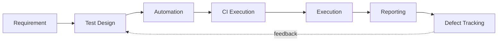

# ICM Test Automation — Approach

End-to-end methodology for the ICM Playwright BDD workspace (`projects/icm`).

**Flow:** Requirement → Test Design → Automation → CI → Execution → Reporting → Defect Tracking



---

## 1. Requirement → Test Scenario Identification

The starting point is always the manual explorer: **you explore the app step by step and
paste each screen, element, and flow into the prompt** with the XPath / `data-testid` / text
you found. The model never guesses the UI.

### 1a. Capture requirements (what you give the model)

| Input | What it is | Example |
|---|---|---|
| App step walkthrough | Exact click order + page transitions | "Open Statement Upload → pick Aetna ACA → Browse → Upload" |
| Helping locators | XPath / testid / role / text that worked in devtools | `//div[@col-id='__warning__'] .lucide-triangle-alert` |
| Expected result per step | What the spec says should happen | "Warning tooltip shows 'New Policy'" |
| Test data note | Unique keys, template files, seed data | "Customer UID must be new or it shows Renewal" |
| Env + role | Which environment and login | "preprod.app.pieq.ai, Agency 3 ops manager" |

### 1b. Scenario identification

Derive scenarios one-to-one from each requirement row / spec step / CSV row:

1. Split the requirement into *independent, verifiable behaviors* (one `Scenario` each).
2. Tag every scenario with a unique `@TEST-{NNN}-{Module}-{Area}` ID (per
   `feature-test-case-ids` skill).
3. Keep step text unique across all modules — grep `steps/**/*.steps.ts` first, add a
   page-name suffix on conflict (`step-conflict-resolution` skill).
4. For statement/advance modules, note the **Customer UID rule** (see §6d).

Output: a `.feature` file under `features/<module>/` + the manual-test mapping in a table.

---

## 2. Automation Feasibility Analysis

Before writing code, score each scenario to decide UI vs API vs skip.

| Criterion | Score it as | Skip / lower priority when |
|---|---|---|
| Frequency of manual execution | High = automate | One-off ad-hoc checks |
| Business criticality | High = automate | Cosmetic-only behavior |
| UI stability (testid coverage) | Stable testid = automate | Heavy shadow DOM / dynamic ids w/o helpers |
| Data setup complexity | Manageable = automate | Needs manual 3rd-party data not reachable |
| Extract/async latency | Predictable poll = automate | Undefined wait windows, flaky by design |

**Decisions land in the feature file as tags:**
- `@smoke` — critical-path, `expect.soft` tolerated
- `@regression` — full module suite
- `@bug` — app defect: assert *expected* (spec) behavior, add `# Known issue` comment
- `@skip` — feasibility says no (document why in `#` comment)

**API vs UI coverage:**
- **UI** (this repo) — end-to-end, cross-page assertions, upload→review→reconcile flows.
- **API** — preferred when a capability is pure data validation or setup (login, data
  seeding, statement prep) and the UI adds no logic on top. Verify with a quick
  `browser_evaluate`/network inspection before committing to a UI-only approach.
- Rule of thumb: **UI for behavior users see; API for setup + data-heavy assertions.**

---

## 3. Test Design — BDD/Gherkin

The spec/exploration notes are written as Gherkin *before* any step code.

### 3a. Feature file rules (playwright-bdd-regression skill)

```gherkin
@validate-statement-processing @icm
Feature: Validate statement processing uploads

  Background:
    Given I am logged into PieQ ICM for statement processing tests

  @TEST-001-Statement-Processing
  Scenario: Valid single-row statement shows New Policy and completes review
    Given a valid single-row statement file is prepared
    When I upload the prepared statement
    Then the upload file status shows "Waiting" and stage shows "Review"
    And the warning tooltip contains "New Policy"
    When I complete the review
    Then the file stage shows "Completed"
```

- `Background` = login only; every scenario starts from the module's isolated context.
- Strong `Then` steps: assert **content**, not just visibility (`bdd-contextual-assertions`
  skill — never ship a visibility-only `Then`).
- Close every modal/panel the scenario opens (last step).
- `Scenario Outline` + `Examples` only when data-driven; one test-case ID per outline.

### 3b. User → model authoring loop

```
You explore app (step-by-step + XPath) 
   → paste walkthrough into prompt
   → model loads skills (step-conflict-resolution, feature-test-case-ids, playwright-bdd-regression)
   → model writes feature file + steps + POM bottom-up
   → model runs once (Auto-Run on Generate)
   → fixes locators/wiring (max 2–3 iterations) or escalates
```

---

## 4. Automation — Playwright + POM + Skills/Agents

### 4a. Page Object Model architecture

```
pages/<module>/<PascalCase>Page.ts          → loc map + interactions + read helpers
pages/<module>/<PascalCase>Assertions.ts    → cross-page / multi-step read-only expects
steps/<module>/<topic>.steps.ts             → Given/When/Then wiring
steps/<module>/common.steps.ts              → BeforeAll/AfterAll, isolated context
utils/<module>/<module>Context.ts           → set/get/clear state between steps
test-data/<module>/<camelCase>.ts           → config + builder factories
steps/fixtures.ts                           → register every page object
features/<module>/<kebab-case>.feature      → Gherkin
TestFiles/<module>/                         → Excel/CSV templates; .generated/ = runtime files
```

- **POM standard:** all locators declared once in the `loc` map; interaction methods only;
  `expect*` methods are read-only (no clicks/navigation inside assertions).
- **Locator priority:** `data-testid` → `getByRole`/`getByLabel` → text → CSS/XPath last resort.
  Never guess — read the `loc` map first, then live discovery.
- **Reuse first, create second:** grep for an existing page method / step / context field /
  fixture before adding anything new (instructions §2).

### 4b. Live locator discovery — Playwright MCP (default)

Playwright CLI is disabled. Workflow (browser-discovery rule):

```
1. POM loc map → write code (no browser)
2. Playwright MCP → browser_evaluate (small JSON), scoped snapshot as fallback
3. Persist to POM → validate with test runner
```

```javascript
// discover testids cheaply
() => [...document.querySelectorAll('[data-testid]')].map(el => el.getAttribute('data-testid')).sort()
```

One login per session; persist findings into the POM immediately.

### 4c. Which skill / agent runs when

| Task | Skill(s) to load | Agent |
|---|---|---|
| New scenarios (step text uniqueness) | `step-conflict-resolution` | regression-writer |
| Assigning test case IDs | `feature-test-case-ids` | regression-writer |
| Known bugs / before-after / sidebar headings | `assertion-patterns` | regression-writer |
| Full wiring feature→steps→pages | `playwright-bdd-regression` | regression-writer |
| Writing from manual CSV | `validate-csv-bdd-coverage` | regression-writer |
| Statement/advance/commission flows | `statement-processing` | regression-writer |
| Strengthening weak `Then` steps | `bdd-contextual-assertions` | regression-writer |
| Failing tests after codegen / regression | `fix-harvested-e2e-tests` | **regression-fixer** |

**Slash commands** (`.opencode/commands/`):
- `/run-test <module-tag> [--headed]` — `yarn test -g @<tag>`
- `/fix-test <module-tag> [grep]` — run, triage, fix, re-run until green or `@bug`

**Regression-fixer workflow:** narrow `--grep` for 3–8 failing `@TEST-*` tags → classify
(locator / interaction / assertion / flake / app bug) → Playwright MCP investigation → minimal
patch (page methods → steps → feature) → `npx bddgen` if step text changed → re-run.

**Escalation rule:** one simple investigation + locator/wiring fix allowed after a generated
test fails; if it still fails, **escalate to a human** — do not keep guessing
(`escalate-on-stuck.mdc`).

### 4d. Excel statement prep — Customer UID persistence (required)

Advance / policy-cancellation uploads treat an existing Customer UID as a **Renewal**; a new
UID shows the **"New Policy"** warning. Every `*ExcelPrep.ts` advance-payout `prepare()`
function must:

1. Read the template from `TestFiles/<module>/`.
2. Increment **Customer UID by +1** on every data row (preserve prefix + zero-padding).
3. Write a timestamped copy under `TestFiles/<module>/.generated/`.
4. **Persist the incremented workbook back to the template**
   (`await wb.xlsx.writeFile(templatePath)`) so the next run advances again.

Recovery / chargeback prep reuses the stored PolicyNumber — never invent a UID there, and
never overwrite the advance template from recovery/chargeback prep.

---

## 5. API / UI Coverage Decision

| Layer | Used for | Example in this repo |
|---|---|---|
| **API** | Setup, data seeding, pure validation | Login env, Excel prep, statement file generation |
| **UI (E2E)** | User-visible behavior, cross-page flow | Upload → extract poll → Review → reconcile → ledgers |

Hybrid note: when the UI path is slow or flaky (async extract polls, LOCK_CONFLICT), keep the
assertion at the UI boundary you care about and do heavy data verification via
`browser_evaluate`/network inspection rather than pixel-level UI checks.

---

## 6. Regression Strategy

1. **Module isolation** — each module tag owns its browser context
   (`BeforeAll`/`AfterAll` in `common.steps.ts`). No state leaks across modules.
2. **Tiering by tag:**
   - `@smoke` — run on every change, `expect.soft`, fastest signal.
   - `@regression` — full module suite, normal `expect`.
   - `@bug` — assert spec behavior; keep failing so the defect stays visible.
3. **Retries** — `retries: 2` in `playwright.config.ts` for flake absorption; targeted
   investigation uses `--retries=0`.
4. **Targeted triage** — a failing suite is narrowed to 3–8 `@TEST-*` tags before fixing.
5. **Data hygiene** — `.generated/` cleaned in `AfterAll`; templates advanced (UID +1) per
   run so suites create genuinely new policies each time.
6. **Env contention** — run statement/advance suites in isolation (shared preprod
   LOCK_CONFLICT on reconcile when another suite is mid-run).

---

## 7. CI Execution

Current repo scripts: `ci-collect-failure-context.mjs`, `ci-post-slack-summary.mjs`
(`.ci/failure-context.md`, `.ci/run-outcomes.json`, `.ci/slack-thread.json`).

**Local (same as CI gate):**
```powershell
yarn bddgen                       # generate specs from .feature
yarn test -g "@<module-tag>"      # single module
yarn test -g "@smoke"             # smoke gate
```

**Proposed CI pipeline (per commit / nightly):**
1. `yarn bddgen` → `tsc --noEmit` type gate.
2. `yarn test -g "@smoke"` — fast fail on critical path.
3. `yarn test` (module suites) — `workers: 3`, `fullyParallel: false`, `retries: 2`.
4. Collect failures → `.ci/failure-context.md` → post Slack summary
   (`scripts/slack-reporter.ts`, no-op unless `SLACK_BOT_TOKEN` + `SLACK_CHANNEL_ID` set).
5. Non-blocking on known `@bug`; blocking on everything else.

---

## 8. Reporting

| Artifact | Source | Consumers |
|---|---|---|
| Playwright HTML report | `playwright-report/` | Engineers |
| Cucumber HTML report | `cucumber-report/index.html` | QA / management |
| Slack run summary | `scripts/slack-reporter.ts` | Team channel |
| Trace (`on-first-retry`) + screenshot on failure | `test-results/` | Failure analysis |
| `.ci/run-outcomes.json` | CI run results | Trend / flake analysis |

Every failure report must answer: root cause class (locator/interaction/assertion/flake/app
bug), files changed, evidence (trace/screenshot), re-run command.

---

## 9. Defect Tracking

1. **App bug ≠ test bug.** If the app violates the spec, the test is right to fail — that is
   the signal. Tag the scenario `@bug`, assert *expected* behavior, add a `# Known issue`
   comment referencing the defect.
2. **Log it** with: scenario tag, step that exposed it, live evidence (screenshot/trace),
   expected vs actual.
3. **Keep it visible** — never delete or soften a `@bug` scenario to make the suite green.
4. When the defect is fixed, remove `@bug`, tighten the assertion to the now-correct behavior,
   and re-run the module.

---

## 10. End-to-end checklist (per new module/feature)

- [ ] You explored the app step-by-step and pasted walkthrough + helping XPaths
- [ ] Scenarios identified 1:1 from requirements/CSV, mapped to `@TEST-*` IDs
- [ ] Feasibility scored; UI/API split decided; `@smoke`/`@regression`/`@bug` tags assigned
- [ ] Feature file authored (strong `Then` steps, modals closed, step text unique)
- [ ] Skills loaded before authoring: `step-conflict-resolution`, `feature-test-case-ids`,
      `playwright-bdd-regression`, `bdd-contextual-assertions`
- [ ] Pages + assertions written to POM standard; fixtures registered; context fields
      set/get/clear wired; no shared methods changed for one-off scenarios
- [ ] Excel prep: Customer UID incremented, `.generated/` copy + template persisted
- [ ] `npx bddgen` passes
- [ ] Test run once immediately (Auto-Run on Generate); ≤2–3 fix iterations else escalate
- [ ] Regression: full module suite green (excluding `@bug`)
- [ ] CI gate (`@smoke` → modules) green; Slack summary posted
- [ ] Defects tracked as `@bug` + `# Known issue`; report artifacts available
