# ICM CI & Slack Reporting — Presentation Deck

> Mermaid charts for slides. Business-readable, optimized for Google Slides (16:9, 3-row TB layout).

---

## Slide 1 — Title

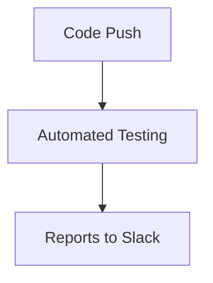

**CI Trigger, Workflow & Slack Reporting**

---

## Slide 2 — How the Pipeline Works

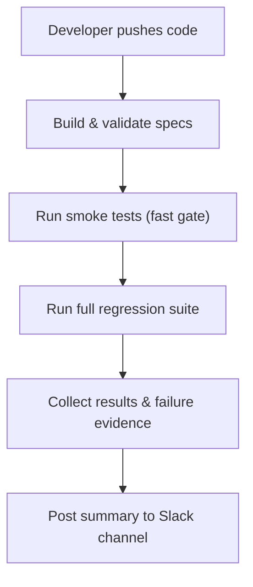

| Stage | What happens |
|---|---|
| **Push** | Developer pushes code to repo |
| **Build** | Generate test specs, type-check |
| **Smoke** | Quick gate — 92 critical cases |
| **Full Run** | 388 cases across 21 modules |
| **Collect** | Gather traces, screenshots, error context |
| **Notify** | Post to Slack with report attached |

---

## Slide 3 — What Gets Posted to Slack

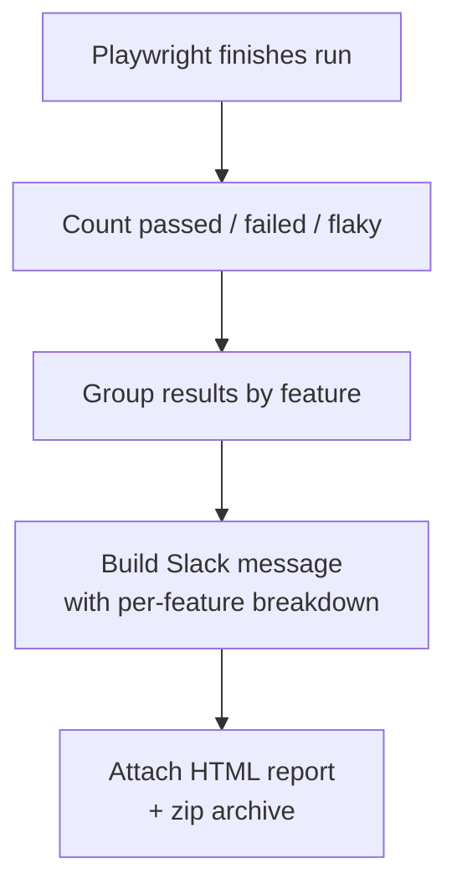

**Slack message includes:**
- Red / green indicator
- Per-feature breakdown (counts + failed case IDs)
- Grand total (passed, failed, flaky, skipped)
- Duration and environment
- Attached `index.html` report

---

## Slide 4 — Slack Message Example

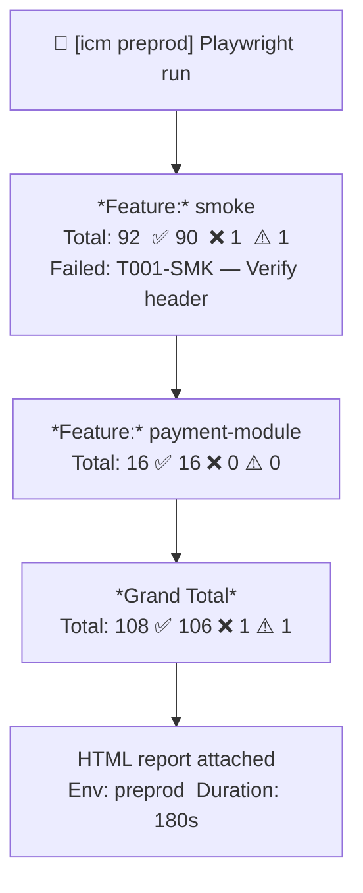

---

## Slide 5 — When Things Fail

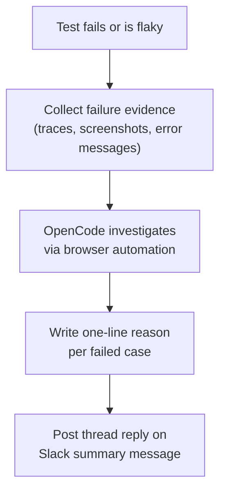

| Step | What happens |
|---|---|
| **Collect** | Gather trace files, error context from test results |
| **Investigate** | OpenCode agent opens browser, reproduces the failure |
| **Reason** | Write a plain-English reason for each failed case |
| **Reply** | Post as a thread on the original Slack message |

---

## Slide 6 — Thread Reply Example

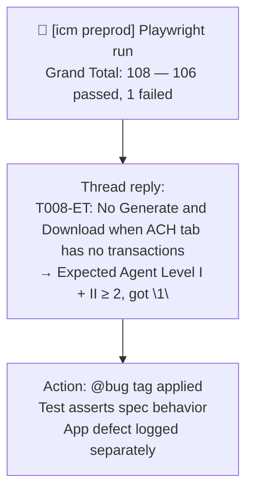

---

## Slide 7 — Report Outputs

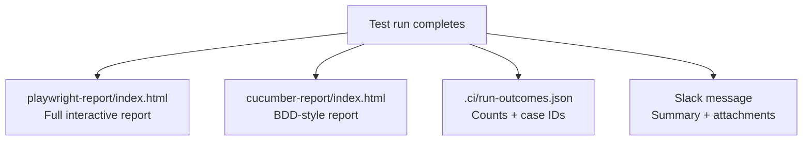

| Output | Purpose |
|---|---|
| `playwright-report/` | Detailed test results with traces |
| `cucumber-report/` | BDD-formatted report |
| `.ci/run-outcomes.json` | Machine-readable results for automation |
| Slack message | Team visibility, no need to check CI logs |

---

## Slide 8 — Failure Context Collection

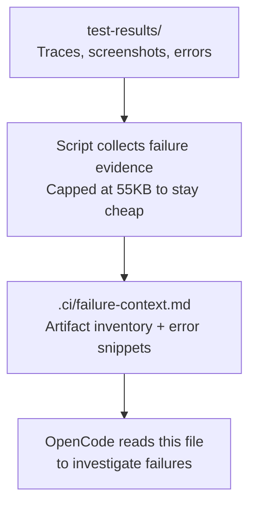

---

## Slide 9 — Configuration

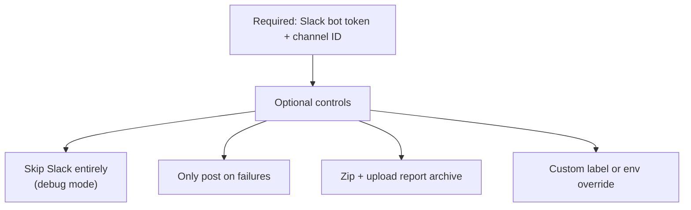

| Config | What it does |
|---|---|
| `SLACK_BOT_TOKEN` | Connects to your Slack workspace |
| `SLACK_CHANNEL_ID` | Target channel for reports |
| `SLACK_DISABLED` | Turn off Slack during debugging |
| `SLACK_NOTIFY_ON_FAILURE_ONLY` | Only post when something fails |
| `SLACK_UPLOAD_ZIP` | Include full report archive |

---

## Slide 10 — Safety Design

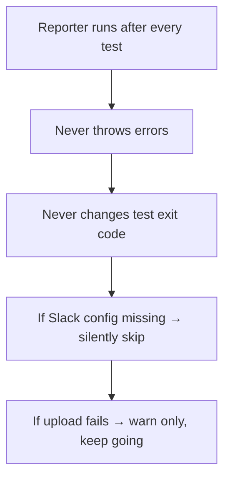

**Key principle:** The reporting system must never break the test pipeline, even if Slack is down or misconfigured.

---

## Slide 11 — End-to-End Summary

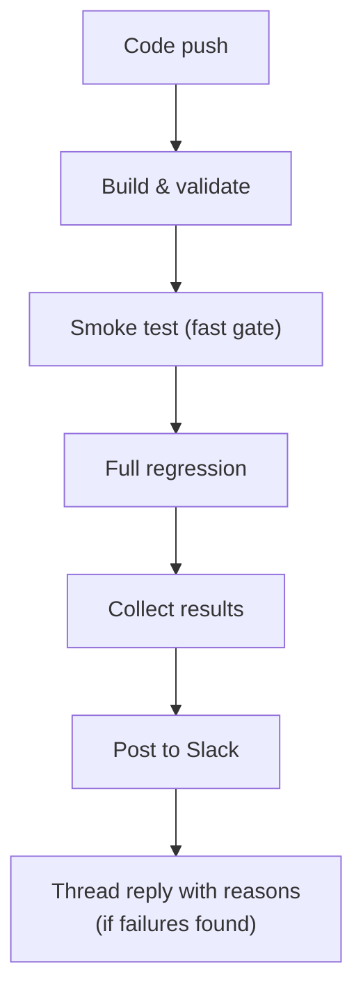

**Flow:** `push → build → smoke → full run → collect → Slack → investigate → reply`
