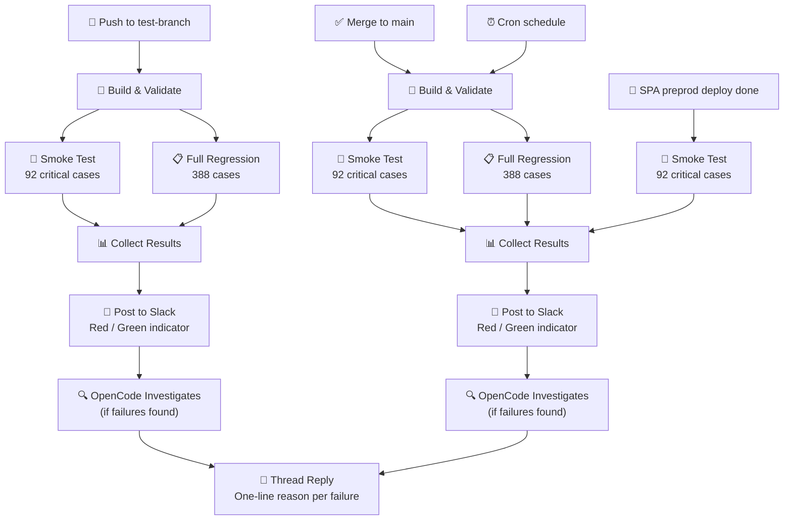

# ICM CI Workflow



---

## What Happens at Each Step

| Step | Emoji | What happens |
|---|---|---|
| **Push to test-branch** | 🔀 | Developer pushes code to feature branch — runs smoke + full regression |
| **Merge to main** | ✅ | Code merged to main — runs smoke + full regression |
| **SPA preprod deploy done** | 🚀 | `icm-host-spa` fires `preprod-deployed` — smoke only against live preprod |
| **Cron schedule** | ⏰ | Nightly / weekend — runs full regression to catch environment drift |
| **Build & Validate** | 🔧 | Generate test specs, type-check code |
| **Smoke Test** | 🧪 | 92 critical cases — fast pass/fail gate |
| **Full Regression** | 📋 | 388 cases across 21 modules — complete coverage |
| **Collect Results** | 📊 | Gather pass/fail counts, traces, screenshots |
| **Post to Slack** | 💬 | Summary message with red 🟢 or 🔴 indicator + report attached |
| **Investigate** | 🔍 | OpenCode agent opens browser, reproduces failure, finds root cause |
| **Thread Reply** | 📝 | Plain-English reason posted as thread on Slack summary |

---

## Trigger Comparison

| Trigger | Speed | Coverage | When to use |
|---|---|---|---|
| 🔀 Push to test-branch | Fast | Smoke + full | Every code change before review |
| ✅ Merge to main | Fast | Smoke + full | After approval, before release |
| 🚀 SPA preprod deploy done | Fast | Smoke | After `icm-host-spa` preprod deploy (`preprod-deployed`) |
| ⏰ Cron schedule | Slow | Full only | Catch issues not caused by code changes |

---

## Slack Output Example

```
🔴 [icm preprod] Playwright run

Feature: smoke
  Total: 92   ✅ 90   ❌ 1   ⚠️ 1
  Failed: T001-SMK — Verify header text

Feature: payment-module
  Total: 16   ✅ 16   ❌ 0   ⚠️ 0

Grand Total
  Total: 108   ✅ 106   ❌ 1   ⚠️ 1

HTML report attached
Env: preprod   Duration: 180s
```
