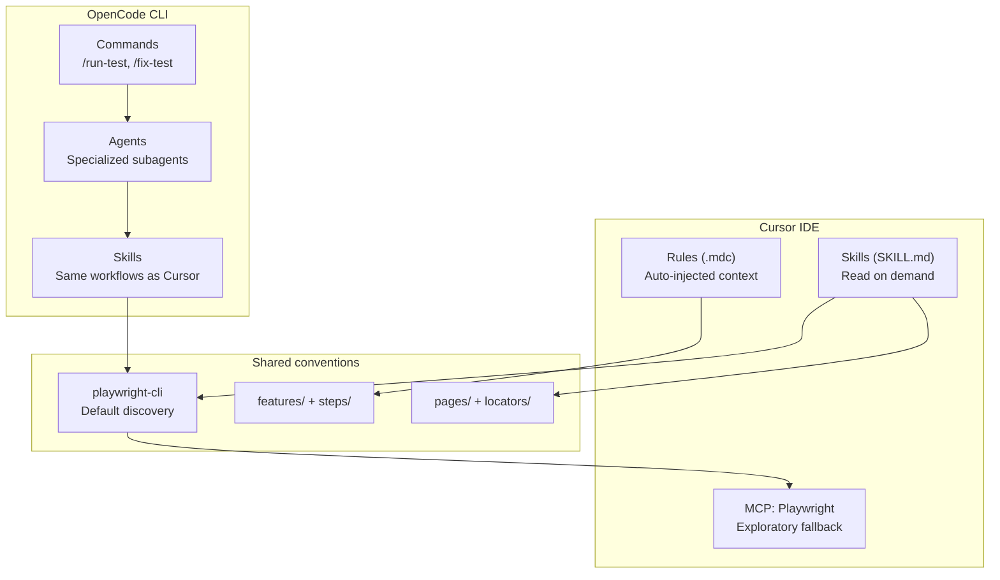

# ICM Test Automation — Skills, Rules & Agents Briefing

Personal reference for how Cursor and OpenCode are set up in `projects/icm` for Playwright BDD work.

---

## How the pieces fit together



| Layer | Where | When it activates |
|-------|-------|-------------------|
| **Rules** | `.cursor/rules/*.mdc` | Always-on or when matching files are open/edited |
| **Skills** | `.cursor/skills/*/SKILL.md` | Agent reads them when the task matches the skill description |
| **OpenCode agents** | `.opencode/agents/*.md` | Invoked as subagents (by command or handoff) |
| **OpenCode commands** | `.opencode/commands/*.md` | Slash commands like `/fix-test agency-dashboard` |
| **OpenCode skills** | `.opencode/skills/*/SKILL.md` | Same content as Cursor skills, for OpenCode agents |
| **CLI reference** | `.claude/skills/playwright-cli/` | Low-level `playwright-cli` command reference |

**Core principle everywhere:** read POM `loc` map first → use `playwright-cli` for live discovery → Playwright MCP only as fallback → persist locators to code → validate with test runner.

---

## Cursor rules (`projects/icm/.cursor/rules/`)

Rules are short, enforceable constraints injected into the AI context.

| Rule | Scope | What it enforces |
|------|-------|------------------|
| **step-conflict-resolution** | `features/**/*.feature` (always on) | Before adding Gherkin steps, search `steps/` for duplicates. If two modules share the same step text, add a page suffix (e.g. `on agency dashboard`). Run `npx bddgen` to verify. |
| **module-regression** | On demand | Each module tag gets its own browser context (`BeforeAll`/`AfterAll` in `common.steps.ts`). Locator discovery hierarchy: POM → playwright-cli → MCP. |
| **playwright-pom-standard** | `pages/**/*.ts` | POM structure: `loc` map, interactions, simple page identity checks. Complex cross-page assertions go in `*Assertions.ts`. |
| **assertion-patterns** | `features/**/*.feature` | `@bug` handling (assert spec, not buggy behavior), before/after capture, sidebar/modal heading validation. |
| **feature-test-case-ids** | `features/**/*.feature` | Every scenario needs `@TEST-{NNN}-{Module}-{Area}`. Sequential per module-area group. |
| **bdd-contextual-assertions** | features/steps/pages | Pointer to the skill: no visibility-only `Then` steps; use playwright-cli for live text. |

**Repo-level rule** (parent folder): **graphify** — use `graphify query/path/explain` for architecture questions; run `graphify update .` after code changes.

---

## Cursor skills (`projects/icm/.cursor/skills/`)

Skills are longer playbooks the agent follows end-to-end.

### 1. `bdd-playwright-cli`
**Use when:** Writing steps and page objects from a `.feature` file.

**Workflow:**
1. Read existing POM `loc` map
2. Open browser only for unknown elements
3. Named session (headed + URL): `npx playwright-cli -s=bdd-<module> open https://preprod.app.pieq.ai/ --headed` — reuse same `-s=`; never bare `open`
4. Prefer `eval --raw` over full snapshots (saves tokens); wait for page ready before snapshot
5. Write bottom-up: page object → fixtures → steps → feature
6. Run `npx bddgen` after Gherkin/step text changes

### 2. `bdd-contextual-assertions`
**Use when:** Any edit to features, steps, or page objects.

**Workflow:**
1. Classify each `Then` by intent (display, refresh, equals, columns, etc.)
2. Match assertion depth to Gherkin wording — never stop at `toBeVisible()` alone
3. Discover live text via CLI before hardcoding expected strings
4. Dynamic UI → before/after capture in `utils/<module>/*Context.ts`
5. Put assertions in `expect*` methods (read-only, no clicks inside)

### 3. `fix-harvested-e2e-tests`
**Use when:** Tests fail after codegen, bulk POM generation, or regression runs.

**Workflow:**
1. Triage: read POM → steps → feature; run 3–8 failing tags with `--grep`
2. Classify: locator / interaction / assertion / flake / app bug
3. Investigate live app (CLI first)
4. Fix minimally — page methods first, then steps, then feature
5. Known failure patterns: overlay blocking clicks (`check({ force: true })`), missing Apply click, accordion slug mismatches, collapsed sections
6. Tag confirmed app defects `@bug` with `# Known issue` comment
7. Re-run → `graphify update .`

---

## OpenCode setup (`.opencode/`)

OpenCode is a parallel agent runner (uses `@opencode-ai/plugin`). It mirrors Cursor skills but adds **specialized agents** and **slash commands**.

### Agents

| Agent | Mode | Purpose |
|-------|------|---------|
| **regression-writer** | subagent | Writes new BDD tests from spec/CSV/manual cases. Plans file structure, discovers locators, writes bottom-up, validates with `yarn test`/`npm run test`, self-fixes or hands off to fixer. |
| **regression-fixer** | subagent | Diagnoses and fixes failing tests. Narrow `--grep` runs, classifies failures, minimal patches, verifies green or `@bug`. |

**regression-fixer permissions:** edit allowed; bash allowed for `npm run test*`, `npx bddgen`, `npx playwright-cli*`, `graphify*`; everything else asks.

**regression-writer permissions:** edit allowed; bash allowed for `npm run test*` only.

### Commands

| Command | Agent | Usage |
|---------|-------|-------|
| `/run-test <tag> [--headed]` | `build` (default) | Run `npm run test:<tag>`. Fallback: manual bddgen + `playwright test --grep @<tag>`. |
| `/fix-test <module> [grep]` | `regression-fixer` | Run failing tests, follow fix skill, re-run until green or `@bug`. Example: `/fix-test agency-dashboard @TEST-AGD-001\|@TEST-AGD-004` |

### OpenCode skills (mirror of Cursor + one extra)

| Skill | Notes |
|-------|-------|
| `bdd-playwright-cli` | Same as Cursor |
| `bdd-contextual-assertions` | Same as Cursor |
| `validate-csv-bdd-coverage` | CSV → feature coverage audit + Expected Result / assertion depth checks |
| `fix-harvested-e2e-tests` | Same as Cursor |
| **`playwright-bdd-regression`** | **OpenCode-only umbrella skill** — full ICM conventions: architecture, module isolation, test case IDs, POM templates, `common.steps.ts` template, fixture registration. Used by `regression-writer`. |

---

## Supporting pieces

### Playwright CLI reference (`.claude/skills/playwright-cli/`)
Full command reference for `playwright-cli open/goto/click/fill/snapshot/eval/...`. Used by both Cursor and OpenCode when shell-based browser automation is needed. Includes reference docs for session management, storage state, tracing, etc.

### MCP (`.cursor/mcp.json`)
Playwright MCP server (`npx @playwright/mcp@latest`) — **exploratory fallback only** when CLI cannot answer after a focused attempt. Avoids dumping 30K+ token accessibility trees into context when CLI can do the job.

---

## Typical workflows

### Write new tests
```
Spec/CSV → regression-writer (OpenCode) OR Cursor agent
  → playwright-bdd-regression skill (conventions)
  → bdd-playwright-cli skill (locators + POM)
  → bdd-contextual-assertions skill (strong Then steps)
  → validate-csv-bdd-coverage skill (audit CSV rows + Expected Results)
  → npx bddgen → npm run test:<module>
```

### Fix failing tests
```
Failure output → /fix-test <module> (OpenCode) OR Cursor + fix-harvested-e2e-tests skill
  → triage + narrow grep
  → playwright-cli investigate
  → minimal patch
  → npx bddgen (if step text changed)
  → re-run
```

### Add a new module
1. `features/<module>/`, `steps/<module>/common.steps.ts` (isolated context)
2. Page objects in `pages/`
3. Register fixtures in `steps/fixtures.ts`
4. Unique `@TEST-*` tags per scenario
5. Check step text conflicts across all `steps/**/*.ts`

---

## Quick reference — file locations

```
projects/icm/
├── .cursor/
│   ├── rules/          # 6 rules (.mdc)
│   ├── skills/         # 4 skills
│   └── mcp.json        # Playwright MCP
├── .opencode/
│   ├── agents/         # regression-writer, regression-fixer
│   ├── commands/       # run-test, fix-test
│   └── skills/         # 5 skills (includes playwright-bdd-regression)
└── .claude/skills/
    └── playwright-cli/ # CLI command reference + docs
```

---

## Global Cursor skills (outside this project)

Your user profile also has global Cursor skills at `~/.cursor/skills-cursor/` (automate, babysit, canvas, create-hook, create-rule, create-skill, loop, review-bugbot, review-security, sdk, split-to-prs, statusline, update-cursor-settings). Those are **IDE-wide**, not ICM-specific — they apply to any Cursor workspace, not just this test project.

---

## One-line mental model

**Rules** = always-on guardrails. **Skills** = detailed how-to playbooks. **OpenCode agents** = specialized workers that follow those playbooks with scoped permissions. **playwright-cli** = default eyes on the live app; **MCP** = backup when CLI is stuck.