# ICM Test Automation — Presentation Deck

> Mermaid charts optimized for Google Slides (16:9). All diagrams use 3-row TB layout.

---

## Slide 1 — Title

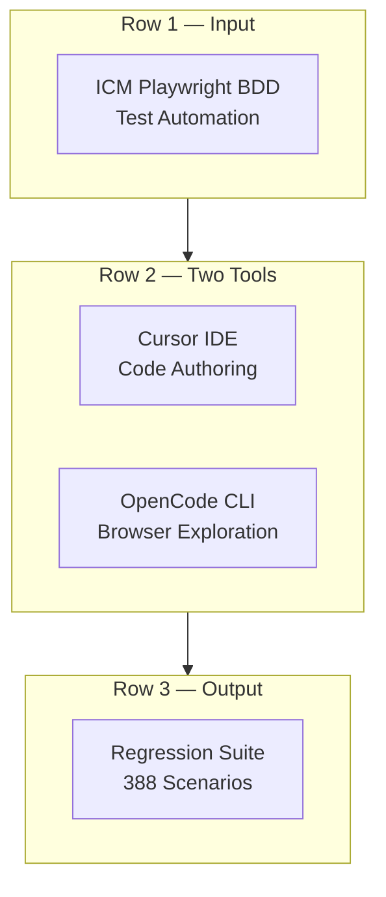

**ICM Test Automation — Cursor + OpenCode Dual-Tool Approach**

---

## Slide 2 — Why Two Tools

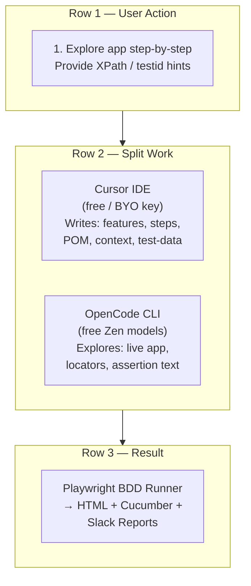

| Role | Tool | Why |
|---|---|---|
| **Code authoring** | Cursor | Full context, rules auto-injected, free |
| **Live app exploration** | OpenCode + Playwright MCP | Free Zen models, browser access |
| **Run & debug** | OpenCode (`/run-test`, `/fix-test`) | Agents + slash commands |
| **CI gate** | Playwright | `yarn test -g @<tag>` |

---

## Slide 3 — Architecture Overview

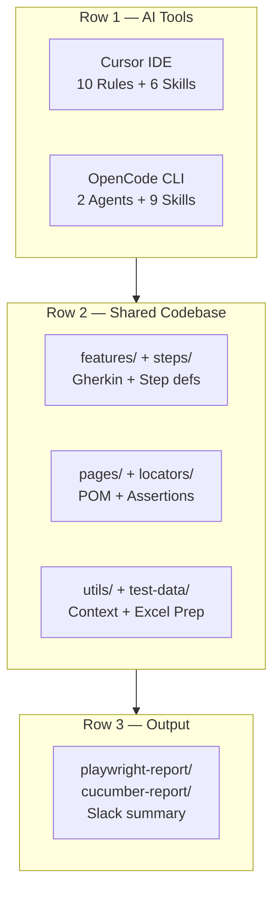

---

## Slide 4 — Cursor: Rules & Skills

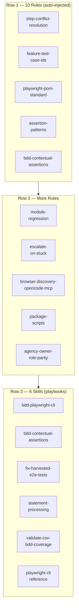

---

## Slide 5 — OpenCode: Agents & Skills

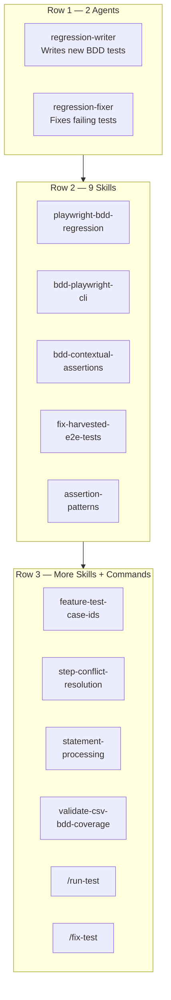

---

## Slide 6 — Cost-Effective Workflow

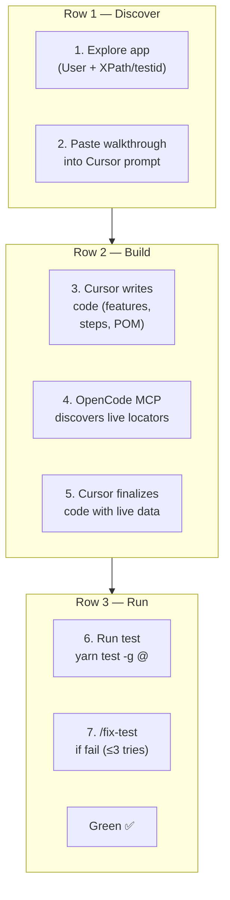

| Step | Tool | Cost |
|---|---|---|
| 1–2. Explore + prompt | User + Cursor | Free |
| 3–5. Write + finalize | Cursor + OpenCode MCP | Free |
| 6–7. Run + debug | Playwright + OpenCode agent | Free |

---

## Slide 7 — Module Isolation Pattern

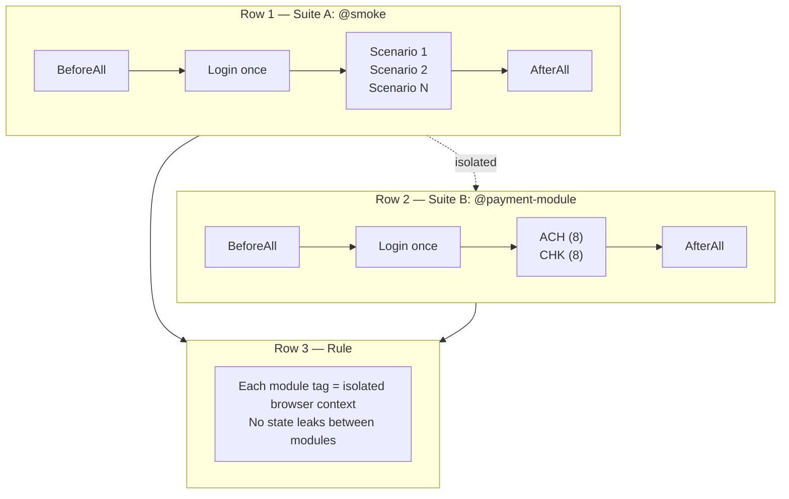

---

## Slide 8 — Page Object Model Standard

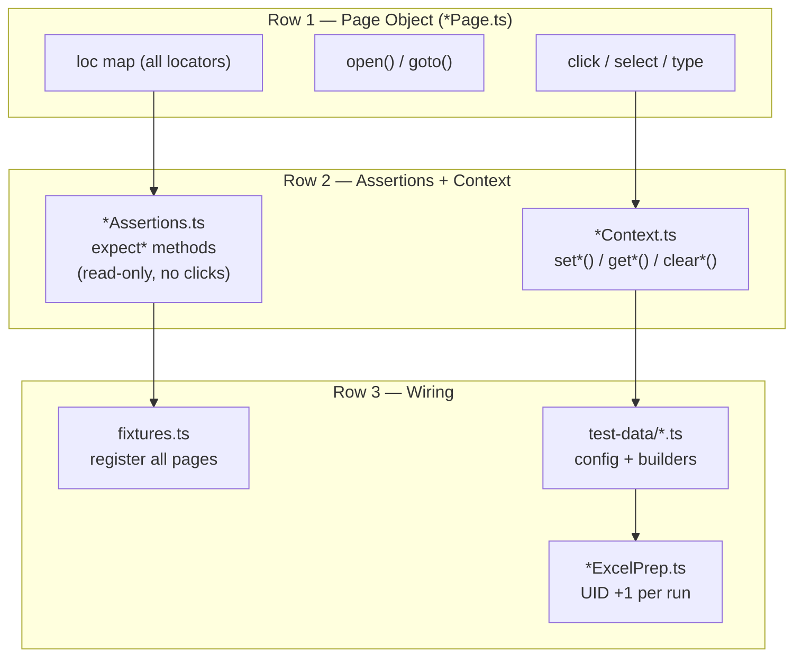

---

## Slide 9 — Test Architecture

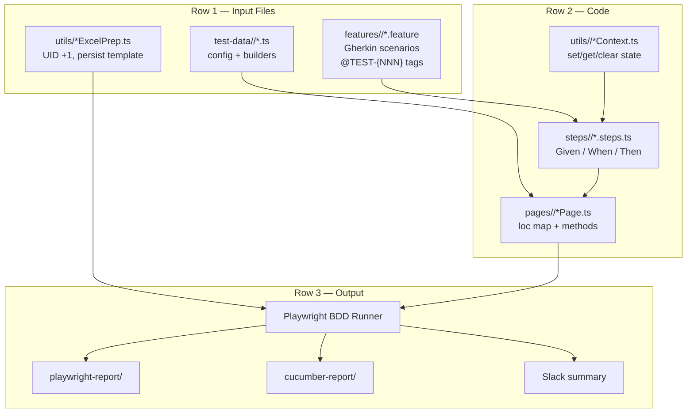

---

## Slide 10 — Current Suite Stats

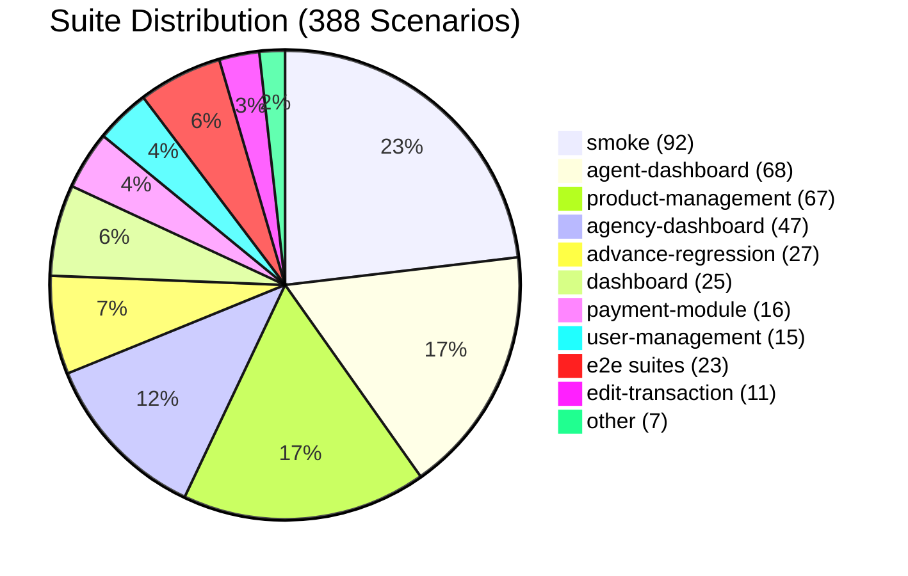

| Metric | Value |
|---|---|
| Feature files | 25 |
| Total scenarios | 388 |
| Module suites | 21 |
| E2E scenarios | 23 |
| Regression scenarios | 54 |
| Bug-tagged (`@bug`) | 5 |

---

## Slide 11 — E2E Phases

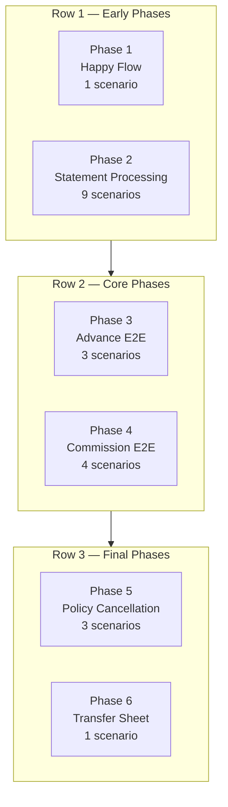

| Phase | Scenarios | Status |
|---|---|---|
| Happy Flow | 1 | Written, not run |
| Statement Processing | 9 | SP-001 green live |
| Advance E2E | 3 | Written, not run |
| Commission E2E | 4 | Written, not run |
| Policy Cancellation | 3 | Written, not run |
| Transfer Sheet | 1 | Written, not run |

---

## Slide 12 — CI Pipeline

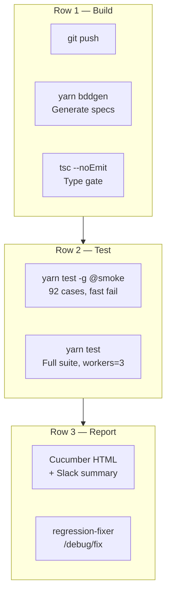

---

## Slide 13 — One-Line Mental Model

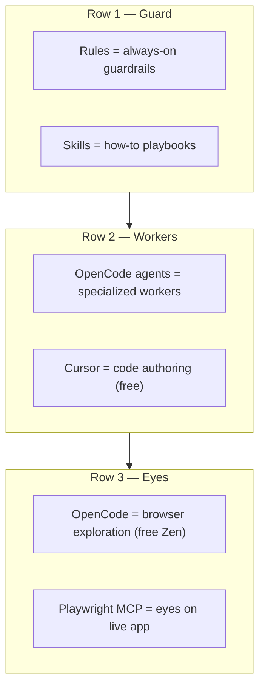
